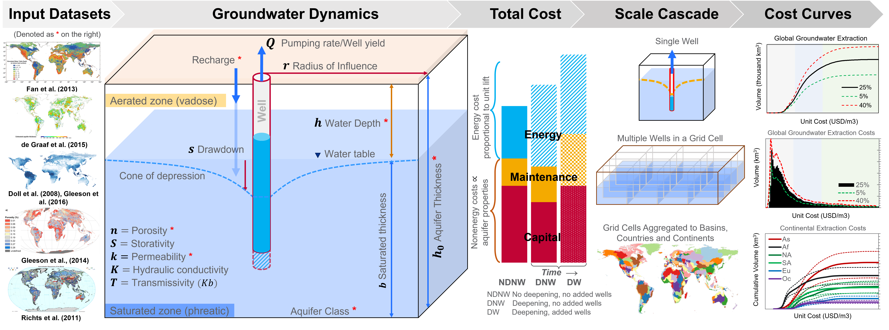

[](https://github.com/JGCRI/superwell/actions/workflows/build.yml)
[](https://github.com/JGCRI/superwell/actions/workflows/test_coverage.yml)
[](https://codecov.io/gh/JGCRI/superwell)
[](https://github.com/JGCRI/superwell/actions/workflows/docs.yaml)
[](https://joss.theoj.org/papers/ae736aa6e75758498cf79ab8ec3fa886)

# _superwell_: A physics-based hydro-economic model for groundwater cost and supply assessment

The [`superwell`](https://github.com/JGCRI/superwell.git) model provides estimates of the global extractable volumes and unit-costs $(USD/km^3)$ of accessible groundwater production under user-specified extraction scenarios.  
The structure of [`superwell`](https://github.com/JGCRI/superwell.git) is:

- input driven  
- fast, flexible and robust  
- spatially and temporally flexible (covers grid to global and hourly to centennial scales)  

> _Key model documentation & primary citation:_ \
Niazi, H., Ferencz, S., Graham, N., Yoon, J., Wild, T., Hejazi, M., Watson, D., & Vernon, C. (2024; In-prep). [Long-term Hydro-economic Assessment Tool for Evaluating Global Groundwater Cost and Supply: Superwell v1](https://gmd.copernicus.org/preprints/). _Geoscientific Model Development_.

## Getting Started  

[`superwell`](https://github.com/JGCRI/superwell.git) can be installed directly from its [GitHub repository](https://github.com/JGCRI/superwell.git) by simply cloning it. Run the following from command prompt or any terminal that supports `git` commands:

```bash
git clone https://github.com/JGCRI/superwell.git
```

### Run superwell

Navigate to [`python/`](./python/) and run [superwell with deepening](./python/superwell_deepening.py) script to simulate using default settings and scenario assumptions. Installing `python` and key libraries is evidently a pre-requisite.

Adjust [params.csv](./inputs/params.csv) in [`inputs/`](./inputs/) folder to fit your scenario design needs. The script will automatically populate results in [`outputs/`](./outputs/) folder.  

### Conceptual Overview



## Inputs

All inputs are in [`inputs/`](./inputs/) folder. The [`superwell`](https://github.com/JGCRI/superwell.git) code requires two primary input files:

- [params.csv](./inputs/params.csv) defining model settings and scenario assumptions  
- [inputs.csv](./inputs/inputs.csv) containing grided aquifer thickness, porosity, depth to water, permeability, grid area, WHY class, and grid area

and two supporting data files:

- [GCAM_Electricity_Rates.csv](./inputs/GCAM_Electricity_Rates.csv) providing  assumptions on the cost of electricity in 172 countries
- [Theis_well_function_table.csv](./inputs/Theis_well_function_table.csv) as a look-up table for relation between $u$ and well function $W(u)$  

[`inputs/`](./inputs/) folder also contains digitized, geo-processed [shape files](./inputs/shapefiles/) of aquifer properties that makes the contents of the [inputs.csv](./inputs/inputs.csv) file after processing.

> _Cite input data as:_ \
Niazi, H., Watson, D., Hejazi, M., Yonkofski, C., Ferencz, S., Vernon, C., Graham, N., Wild, T., & Yoon, J. (2024). [Global Geo-processed Data of Aquifer Properties by 0.5° Grid, Country and Water Basins](https://doi.org/10.57931/2307831). MSD-LIVE Data Repository. <https://doi.org/10.57931/2307831> \
[](https://doi.org/10.57931/2307831)

See [documentation on inputs](./inputs/README.md) for more details.  

## Outputs  

All outputs are written to [`outputs/`](./outputs/) folder as `.csv` formats.
A select-few key outputs include: extractable volumes, drawdown, number of wells, costs including capital, maintenance, pumping, and unit costs of groundwater production.  

> _Cite output data as:_ \
Niazi, H., Ferencz, S., Yoon, J., Graham, N., Wild, T., Hejazi, M., Watson, D., & Vernon, C. (2024). [Globally Gridded Groundwater Extraction Volumes and Costs under Six Depletion and Ponded Depth Targets](https://doi.org/10.57931/2307832). MSD-LIVE Data Repository. <https://doi.org/10.57931/2307832> \
[](https://doi.org/10.57931/2307832)

See [documentation on outputs](./outputs/README.md) for more details.

## Structure

Folder structure of [`superwell`](https://github.com/JGCRI/superwell.git) is as follows:

| Folder                           | Description                                                        |
|----------------------------------|--------------------------------------------------------------------|
| [`inputs/`](./inputs/)           | contains necessary input data files and scripts to generate them           |
| [`python/`](./python/)           | contains main superwell python scripts (e.g., [superwell_deepening.py](./python/superwell_deepening.py))    |
| [`outputs/`](./outputs/)         | default folder where results are saved                           |
| [`processing/`](./processing/)   | contains diagnostics and post-processing scripts, along with key figures |
| [`R/`](./R/)                     | contains `.R` script for the **old** version of the model   |
| [`man/`](./man/)                 | package documentation of functions |
| [`tests/`](./tests/)             | test scripts to verify the correct functioning of the model's components            |

## Key References

Several high-impact publications and data products have utilized [`superwell`](https://github.com/JGCRI/superwell.git) to inform groundwater unit costs to discover key interactions and dynamics within coupled human-Earth systems.

### Papers

- Niazi, H., Wild, T., Turner, S., Graham, N., Hejazi, M., Msangi, S., Kim, S., Lamontagne, J., & Zhao, M. (2024; In-press). [Global Peak Water Limit of Future Groundwater Withdrawals](https://www.nature.com/natsustain/). _Nature Sustainability_.

- Turner, S., Hejazi, M., Yonkofski, C., Kim, S., & Kyle, P. (2019). [Influence of Groundwater Extraction Costs and Resource Depletion Limits on Simulated Global Nonrenewable Water Withdrawals Over the Twenty-First Century](https://doi.org/10.1029/2018EF001105). _Earth's Future_, 7(2), 123-135.

- Hejazi, M., Santos Da Silva, S. R., Miralles-Wilhelm, F., Kim, S., Kyle, P., Liu, Y., Vernon, C., Delgado, A., Edmonds, J., & Clarke, L. (2023). [Impacts of water scarcity on agricultural production and electricity generation in the Middle East and North Africa](https://doi.org/10.3389/fenvs.2023.1082930). _Frontiers in Environmental Science_, 11.

- Yoon et al superwell-ABM in-prep

### Model documentation

- Niazi, H., Ferencz, S., Graham, N., Yoon, J., Wild, T., Hejazi, M., Watson, D., & Vernon, C. (2024; In-prep). [Long-term Hydro-economic Assessment Tool for Evaluating Global Groundwater Cost and Supply: Superwell v1](https://gmd.copernicus.org/preprints/). _Geoscientific Model Development_.

- Niazi/Ferencz et al software documentation JoSS in-prep

<!-- 
### Data

Input data: repo ; contains geo-processed GIS database of aquifer properties and post-processed input files in accessible `.csv` formats

Output data: repo ; contains [`superwell`](https://github.com/JGCRI/superwell.git) outputs of six scenarios varying volume depletion limits (5%, 25%, 40%) and ponded depth targets (0.3m, 0.6m) -->

<!-- 
## Cite the model

- model release citation
  - github version DOI from zenodo

- documentation citation
  - model documentation: GMD
  - software documentation: JoSS

- data citation
  - input data
  - output data 
-->

## Contribute

Reach out to [Hassan Niazi](mailto:hassan.niazi@pnnl.gov) or [Stephen Ferencz](mailto:stephen.ferencz@pnnl.gov) or [open an issue](https://github.com/JGCRI/superwell/issues) in this repository for questions or suggestions.

Stay Super Well! :sunglasses:
