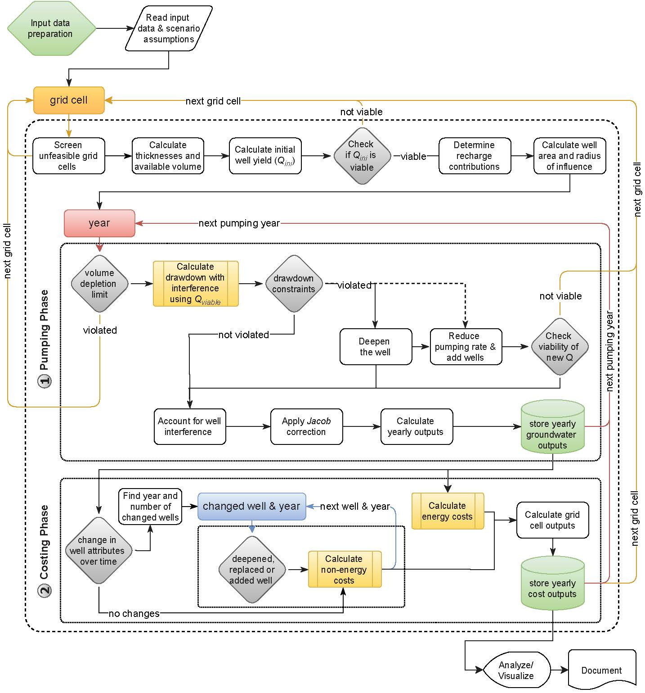

# superwell

[](https://doi.org/10.5281/zenodo.10828260)

## Overview of the Scripts

- [`superwell.py`](./superwell.py): runs the superwell model to simulate groundwater extraction and cost estimation.
- **[`superwell_deepening.py`](./superwell_deepening.py): main superwell script that includes well deepening.**
- [`superwell_deepening_sample.py`](./superwell_deepening_sample.py): Customized version of `superwell_deepening` to run [sampled inputs](../inputs/sampled_data_100.csv) to facilitate quick analysis and testing.
- [`processing.py`](./processing.py): plots a few model results as diagnostics  

## Configuration and Setup

Adjust settings in [`params.csv`](../inputs/params.csv) within the [`inputs/`](../inputs/) folder to match your scenario requirements. This file controls various model parameters like `Country_filter`, `Basin_filter`, `Gridcell_filter`, `Ponded_Depth`, `Recharge_flag`, and `Depletion_Limit`.

Before running the `superwell` scripts, ensure that Python, key libraries, and any other model-specific dependencies are installed.

## Running the Model

To execute the model, run the appropriate script from the command line or an integrated development environment (IDE). For example, to run the deepening version, you would use:

```bash
python superwell_deepening.py
```

This script will process the input data and populate results in the [`outputs/`](../outputs/) folder.

> Be aware that changes to settings in  [params.csv](./inputs/params.csv), such as `Country_filter` and `Gridcell_filter`, will automatically determine the naming of output files. Ensure that previously generated output files are renamed or moved from the [`outputs/`](../outputs/) folder. before re-running the model to prevent overwriting.

## Superwell Algorithm Overview



## Citation

> _Key model documentation & primary citation:_ \
Niazi, H., Ferencz, S., Graham, N., Yoon, J., Wild, T., Hejazi, M., Watson, D., & Vernon, C. (2024; In-prep). [Long-term Hydro-economic Analysis Tool for Evaluating Global Groundwater Cost and Supply: Superwell v1.0](https://gmd.copernicus.org/preprints/). _Geoscientific Model Development_.
